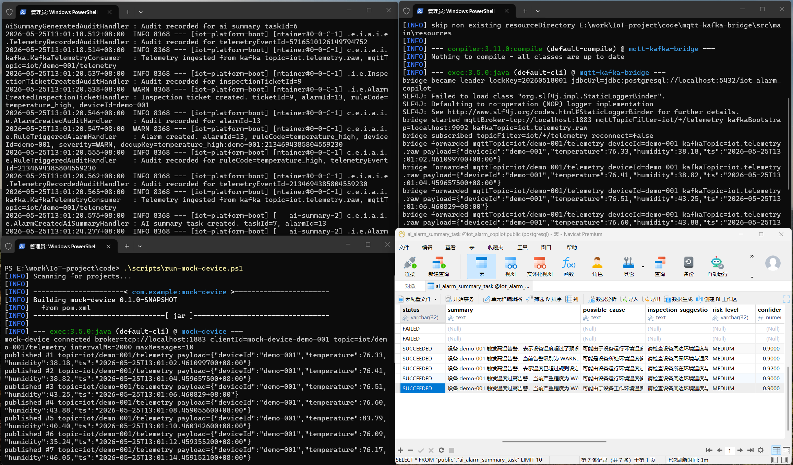

# iot-alarm-copilot

这是一个样板工程，主要为了从0到1学习 IoT后端开发，跑通核心主链路。

当前阶段目标：

-   `环境监测 + 异常告警 + 巡检工单 + AI 摘要`
    
-   `Spring Boot 模块化单体`
    
-   `DDD 上下文边界`
    
-   `Spring Cloud Alibaba Ready`
    

## 当前骨架

```text
.
├─ backend/                  # Java 后端多模块骨架
├─ docker/                   # 依赖镜像
├─ docs/                     # 设计文档与架构图
├─ mock-device/              # Java Mock Device 骨架
├─ scripts/                  # 启动与初始化脚本
└─ README.md
```

## 当前状态



当前完成：

-   跑通了 mock device --> broker --> (mqtt\_kafka\_bridge) --> kafka --> backend --> postgresql (RDBMS and TSDB)
    
-   启动参考 [RUN-LOCAL](RUN-LOCAL.md)
    

下一步继续做：

1.  接 AI 摘要
